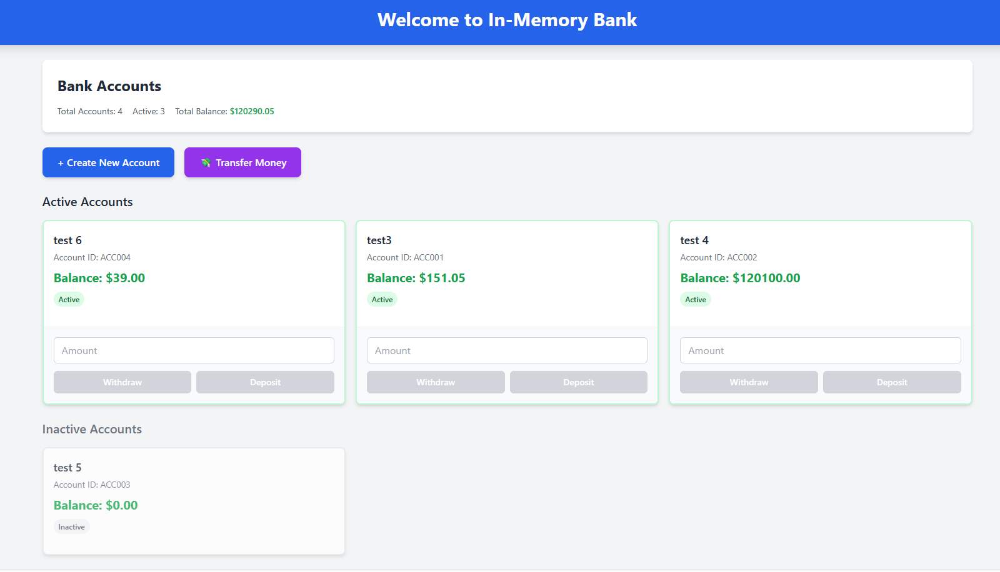
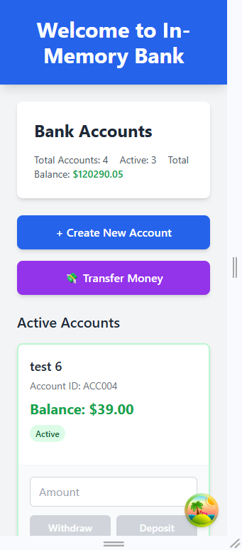
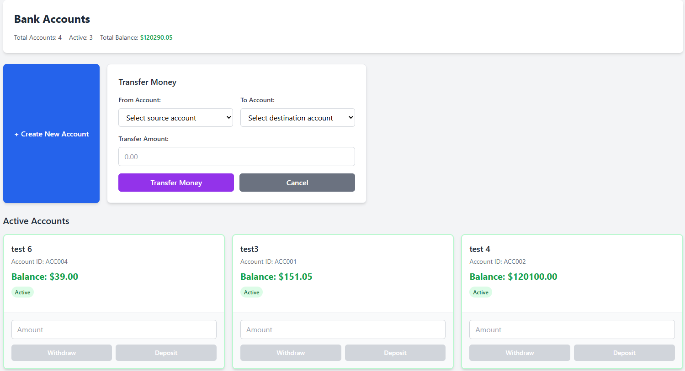
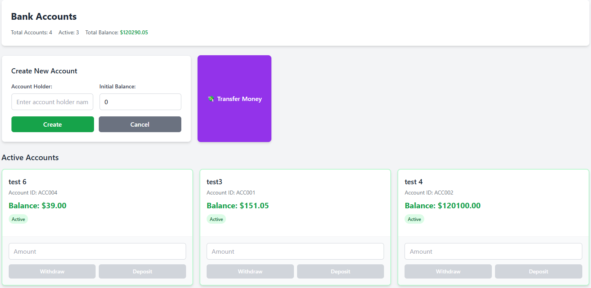

# In-Memory Bank 🏦

A modern React application for managing bank accounts with a clean, intuitive interface. Built with TypeScript, Tailwind CSS, and React Query for optimal performance and developer experience.

## 🚀 Features

- **Account Management**: Create, view, and manage bank accounts
- **Money Transfers**: Transfer funds between accounts
- **Real-time Updates**: Powered by React Query for efficient data fetching
- **Responsive Design**: Mobile-first design with Tailwind CSS
- **Type Safety**: Built with TypeScript for robust development
- **Modern Testing**: Comprehensive test suite with Jest and React Testing Library

## 📋 Prerequisites

Before you begin, ensure you have the following installed:

- **Node.js** (version 16 or higher)
- **npm** (comes with Node.js) or **yarn**
- **Git** (for version control)

## 🛠️ Project Setup

### 1. Clone the Repository

```bash
git clone <repository-url>
cd in-memory-bank
```

### 2. Install Dependencies

```bash
npm install
```

or if you prefer yarn:

```bash
yarn install
```

### 3. Environment Setup

Copy the example environment file and configure it with your settings:

```bash
cp .env.example .env
```

On Windows (Command Prompt):

```cmd
copy .env.example .env
```

On Windows (PowerShell):

```powershell
Copy-Item .env.example .env
```

Open the `.env` file and update the environment variables as needed:

```bash
# Environment variables for In-Memory Bank application
# Copy this file to .env and update the values as needed
# These variables are loaded at build time and must start with REACT_APP_ to be available in the browser

# API Endpoint URLs
REACT_APP_API_BASE_URL=your_api_base_url_here
```

**Important Notes:**

- Environment variables must be prefixed with `REACT_APP_` to be accessible in the React application
- The `.env` file is ignored by Git for security reasons (contains sensitive configuration)
- Always use the `.env.example` file as a template for required environment variables
- Restart the development server after making changes to environment variables

### 4. Start the Development Server

```bash
npm start
```

or with yarn:

```bash
yarn start
```

The application will open in your browser at [http://localhost:3000](http://localhost:3000).

### 5. Available Scripts

- **`npm start`** - Runs the app in development mode
- **`npm test`** - Launches the test runner in interactive watch mode
- **`npm run build`** - Builds the app for production to the `build` folder
- **`npm run eject`** - **Note: this is a one-way operation. Once you eject, you can't go back!**

## 📁 Project Structure

```text
in-memory-bank/
├── public/                     # Static assets
├── screenshots/               # Application screenshots
├── src/                       # Source code
│   ├── app/                   # Main application folder
│   │   ├── components/        # React components
│   │   │   ├── account/       # Account-related components
│   │   │   │   ├── card/      # Account card component
│   │   │   │   ├── form/      # Form components
│   │   │   │   ├── list/      # List components
│   │   │   │   ├── hook.ts    # Custom React hooks
│   │   │   │   ├── model.ts   # TypeScript models/interfaces
│   │   │   │   └── service.ts # API service functions
│   │   │   └── app/           # Main app component
│   │   └── shared/            # Shared utilities and configurations
│   │       └── query/         # React Query configuration
│   ├── utils/                 # Utility functions
```

### 🏗️ Architecture Overview

#### **Component Structure**

- **Atomic Design Pattern**: Components are organized by feature (account) with logical groupings
- **Separation of Concerns**: Each component has a specific responsibility
- **Reusable Components**: Cards, forms, and lists are designed for reusability

#### **State Management**

- **React Query**: Handles server state, caching, and synchronization
- **Local State**: React hooks for component-level state management
- **Custom Hooks**: Encapsulate business logic and API calls

#### **Styling**

- **Tailwind CSS**: Utility-first CSS framework for rapid UI development
- **Responsive Design**: Mobile-first approach with responsive utilities
- **Component-Scoped Styles**: Additional CSS files for component-specific styling

#### **Type Safety**

- **TypeScript**: Provides static type checking and enhanced IDE support
- **Strict Mode**: Enabled for maximum type safety
- **Model Definitions**: Clear interfaces for data structures

## 📸 Screenshots

The `screenshots/` folder contains visual examples of the application:

### Screenshot1.png



*Main dashboard showing the overall application layout and navigation*

### Screenshot2.png



*Account creation form with validation and user input fields*

### Screenshot3.png



*Bank accounts list view showing all available accounts with details*

### Screenshot4.png



*Money transfer form for transferring funds between accounts*

## 🧪 Testing

The project includes comprehensive testing setup:

```bash
# Run tests
npm test

# Run tests with coverage
npm test -- --coverage

# Run tests in CI mode
npm test -- --watchAll=false
```

### Testing Stack

- **Jest**: JavaScript testing framework
- **React Testing Library**: Simple and complete React DOM testing utilities
- **@testing-library/user-event**: Fire events the same way the user does

## 🚀 Production Build

To create a production build:

```bash
npm run build
```

This builds the app for production to the `build` folder. It correctly bundles React in production mode and optimizes the build for the best performance.

## 🔧 Configuration

### Tailwind CSS

The project uses Tailwind CSS for styling. Configuration can be found in `tailwind.config.js`.

### TypeScript

TypeScript configuration is in `tsconfig.json` with strict mode enabled for better type safety.

### React Query

Query client configuration is located in `src/app/shared/query/queryClient.ts`.

## 🤝 Contributing

1. Fork the repository
2. Create your feature branch (`git checkout -b feature/AmazingFeature`)
3. Commit your changes (`git commit -m 'Add some AmazingFeature'`)
4. Push to the branch (`git push origin feature/AmazingFeature`)
5. Open a Pull Request

## 📝 License

This project is licensed under the MIT License - see the LICENSE file for details.

## 🆘 Troubleshooting

### Common Issues

1. **Node.js Version**: Ensure you're using Node.js version 16 or higher
2. **Dependencies**: If you encounter dependency issues, try deleting `node_modules` and running `npm install` again
3. **Port Conflicts**: If port 3000 is in use, the development server will prompt you to use a different port

### Getting Help

- Check the [React documentation](https://reactjs.org/docs)
- Review [TypeScript documentation](https://www.typescriptlang.org/docs)
- Explore [Tailwind CSS documentation](https://tailwindcss.com/docs)
- Read [React Query documentation](https://tanstack.com/query/latest)

---
